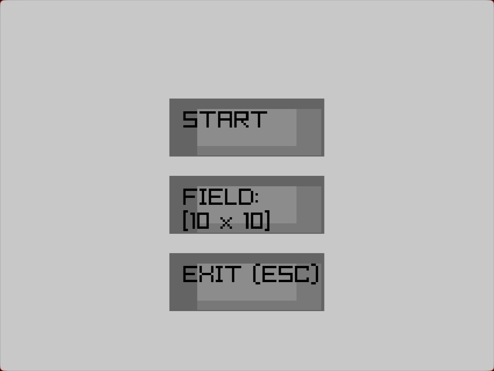
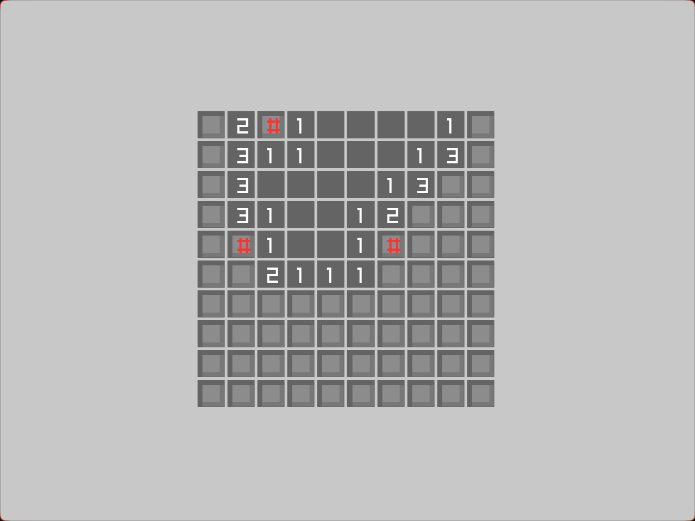
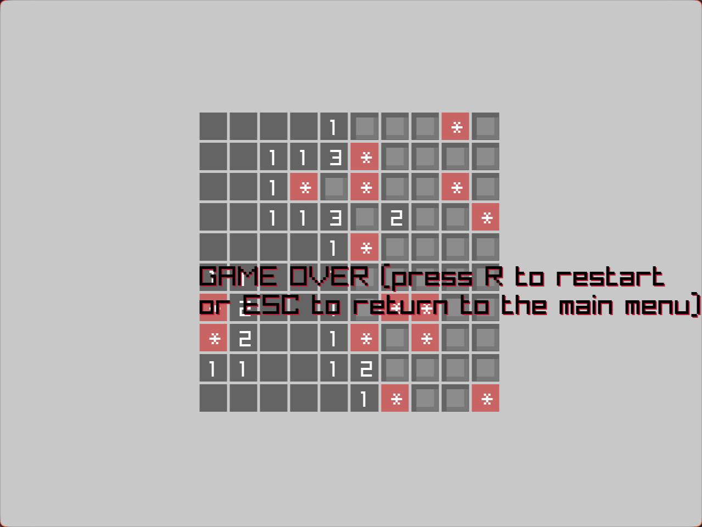
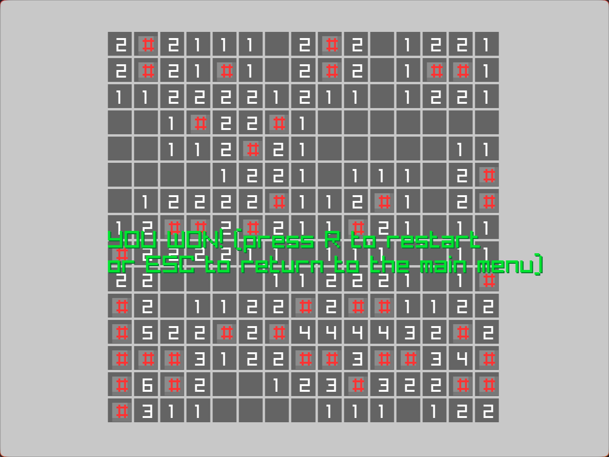

# Minesweeper in C++

## Languages of README

- [English](https://github.com/Senyos/minesweeper-cpp-raylib/blob/main/README.md)
- [Russian](https://github.com/Senyos/minesweeper-cpp-raylib/blob/main/README.ru.md)

## TOC

* [Screenshots](#screenshots)
* [Quick start](#quick-start)
* [About](#about)
* [How to Play](#how-to-play)

## Screenshots









## Quick start

### Dependencies

You'll need to install dependencies into the root directory of the project:

1. Raylib release for target OS: <https://github.com/raysan5/raylib/releases>.
2. Raylib C++ bindings: <https://github.com/RobLoach/raylib-cpp/releases>.

And you'll need a compiler. In this project were used `g++` compiler on _Linux_ and `mingw64` on _Windows_. You can also compile _Windows_ executable on _Linux_ if you install `mingw64`: <https://www.mingw-w64.org/downloads/>.

For _Windows_ choose one with `x86_64-*.*.*-release-win32-seh-msvcrt-rt_v*-rev*.7z` _win32_ and _msvcrt_ (Microsoft Visual Compiler Runtime): <https://github.com/niXman/mingw-builds-binaries/releases>.

### Compilation

First, you'll need to configure Makefile a bit in case naming defers:

```makefile
CCLIN=g++                                                 # Linux compiler
CCWIN=x86_64-w64-mingw32-g++                              # Windows compiler

RAYLIBCPP_INCLUDE=-I./raylib-cpp/include/                 # raylib cpp bindings include

RAYLIBLIN_INCLUDE=-I./raylib-6.0_linux_amd64/include/     # raylib for Linux include
RAYLIBLIN_LIB=-L./raylib-6.0_linux_amd64/lib              # raylib for Linux lib

RAYLIBWIN_INCLUDE=-I./raylib-6.0_win64_mingw-w64/include/ # raylib for Windows include
RAYLIBWIN_LIB=-L./raylib-6.0_win64_mingw-w64/lib/         # raylib for Windows lib
```

Compiling for _Linux_:

```sh
make lin
```

Compiling for _Windows_:

```sh
make win
```

Compiling for _Linux_ and _Windows_:

```sh
make all
```

or

```sh
make
```

Compiled executable files will be stored in the `build/` directory.

## About

A fully functional Minesweeper game built in C++ using the raylib library (<https://www.raylib.com/>). The raylib-cpp bindings (<https://github.com/RobLoach/raylib-cpp>) were used.

## How to Play

In the main menu, you can select a difficulty level by clicking the "FIELD" button multiple times. The "START" button begins the game on the selected field.

On the game board, use the Left Mouse Button (LMB) to reveal a cell and the Right Mouse Button (RMB) to place a flag.

Press R when loose to replay. Press ESC when loose to return to the main menu. Press ESC in the main menu to quit the game.
